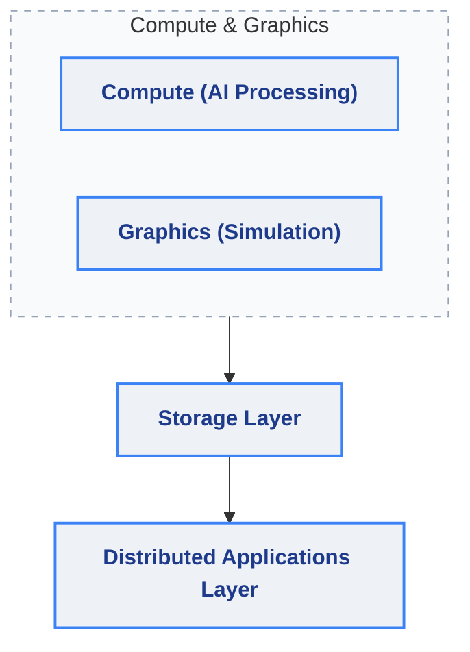
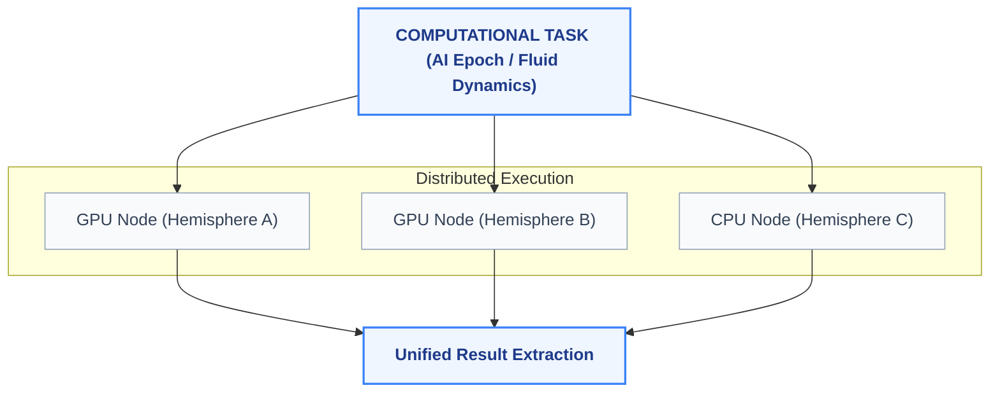
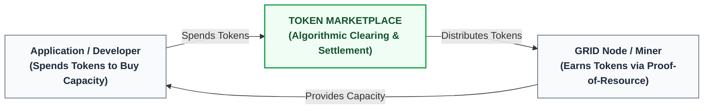
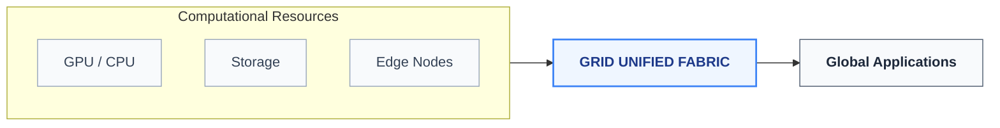

# GRID: World's First Planetary Supercomputer

> "The world's largest supercomputer will not be built in one place. It will emerge from millions of connected machines working together."

---

## Abstract

The world is entering an era where computational demand is expanding through artificial intelligence, simulation, spatial computing, graphics, and digital environments. As technological ambition scales, the fundamental requirements for processing power, data storage, and low-latency execution are far exceeding the physical and logistical constraints of localized data centers. We are witnessing an unprecedented need for a paradigm shift in how computational resources are deployed, managed, and utilized on a global scale.

Traditional computational structures are evolving toward interconnected systems capable of combining millions of independent resources. Historically, expanding computational capacity meant physically building and maintaining vast, centralized facilities. This monolithic approach is naturally bounded by power generation, thermal management limits, and geographic constraints. A new architectural framework is required to seamlessly integrate diverse, globally distributed hardware into a unified computational environment.

GRID introduces Proof-of-Resource: a methodology for measuring, validating, coordinating, and rewarding computational contributions. By moving beyond theoretical consensus mechanisms into practical, measurable hardware utilization, Proof-of-Resource establishes a quantifiable framework for evaluating how effectively a node participates in the network. This methodology guarantees that the underlying infrastructure operates with high fidelity, ensuring that complex tasks are executed efficiently and securely across a trustless environment.

Through the implementation of advanced routing, cryptographic validation, and dynamic resource allocation, GRID transforms distributed hardware into a unified computational fabric. Individual nodes—ranging from personal computers to enterprise-grade servers—are securely orchestrated to function as a singular, cohesive processing entity. This transformation allows parallel workloads to be intelligently distributed, executed, and reassembled with mathematical certainty.

Ultimately, GRID represents a new computational model where computing resources become a connected global infrastructure. By seamlessly weaving together the latent computational potential of millions of independent systems, GRID provides the foundational layer required for the next generation of digital innovation. It is an infrastructure designed not just for the needs of today, but engineered to scale autonomously to meet the expansive computational demands of the future.

---

## Chapter 1: The Evolution of Computing

Computers have historically been defined by individual machines. From the earliest mainframes to modern workstations, the fundamental architecture of computation was inherently localized. A computer was a discrete box containing a processor, memory, and storage, limited by the physical boundaries of its enclosure. Scaling this architecture traditionally required replacing the machine entirely or expanding a localized cluster within a strictly controlled physical environment. This localized paradigm established the operational baseline for software development and computational theory for decades.

The next generation of computing will be defined by networks of machines collaborating together. As global connectivity reaches critical mass and networking protocols achieve extraordinary throughput with minimal latency, the physical boundaries separating machines are dissolving. The conceptual model of a "machine" is transitioning from a physical object into a logical entity distributed across diverse geographical topologies. In this emerging era, bandwidth and synchronization algorithms allow thousands of disparate systems to share memory states and processing cycles as if they were physically connected to the same motherboard.

This fundamental transition underscores a critical realization: A computer is no longer only the hardware contained inside a device. It is the intelligence created by the network connecting computational resources. The processing power of an individual node is secondary to its ability to seamlessly exchange state, data, and execution threads with a vast ecosystem of peers. The true potential of computing now lies in orchestration, synergy, and the emergent capabilities of parallel coordination across a decentralized topology.

This evolution is absolutely necessary to support rapid artificial intelligence growth, real-time graphics, simulation, spatial computing, and large-scale processing. Modern AI models require petabytes of data processing and countless parallel calculations that overwhelm singular clusters. Real-time digital environments and spatial computing demand localized edge-rendering combined with deep logical simulation. Large-scale processing for genomics, fluid dynamics, and atmospheric modeling requires a dynamic, infinitely scalable architecture that can marshal resources exactly when and where they are needed. The historical definitions of computing hardware are giving way to the era of the global computational fabric.

---

## Chapter 2: GRID Architecture

The GRID architecture is constructed upon a layered, highly synchronized framework designed to transform disparate hardware globally into a frictionless processing engine. The architecture ensures that computational tasks are routed, verified, and executed with absolute precision across millions of independent nodes. It decouples the physical hardware from the execution environment, providing developers with a vast, unified interface for large-scale computation.

### GRID Layered Architecture Matrix

### Resource Layer
At the foundational level lies the Resource Layer, composed of the physical machines contributing their latent capacity to the network. This layer is inherently heterogeneous, encompassing a vast spectrum of hardware. It includes high-performance GPUs capable of parallel matrix calculations, multi-core CPUs for sequential logic, expansive storage systems, edge devices positioned for low-latency delivery, and specialized processors (such as neural processing units) engineered for specific mathematical workloads. Every participating device acts as a fundamental building block of the network's total capacity.

### Coordination Layer
Above the physical hardware is the Coordination Layer, the intelligent routing mechanism of the GRID Network. This layer is responsible for continuous resource discovery, mapping the real-time availability and capability of millions of nodes. It handles complex work assignment by breaking down macroscopic tasks into microscopic, executable units. Through advanced scheduling and dynamic optimization, the Coordination Layer ensures that workloads are directed to the most appropriate hardware based on geographic proximity, processor architecture, and current network bandwidth.

### Verification Layer
The integrity of the network is maintained by the Verification Layer. Operating as an impartial auditor, this layer is responsible for measuring exact hardware contributions and validating completed tasks through cryptographic proofs. It constantly evaluates the accuracy of returned computations, mitigating the risk of hardware failure or intentional fault. Furthermore, the Verification Layer maintains a persistent resource reputation system, dynamically scoring nodes based on their historical reliability, uptime, and processing fidelity.

### Application Layer
The highest tier is the Application Layer, providing the universal interface through which complex systems interact with the GRID Network. This layer abstracts the underlying complexity, presenting the global resource pool as a unified environment. It natively supports sophisticated AI workloads, hyper-realistic rendering pipelines, intricate physical simulations, and massive data processing frameworks. Through this layer, applications can instantly draw upon the combined strength of the global network without needing to manage the intricacies of distributed systems.

---

## Chapter 3: Proof-of-Resource Methodology

The foundation of GRID is the Proof-of-Resource methodology. Proof-of-Resource measures real computational contribution. Instead of relying on abstract mathematical puzzles or capital lockups to secure a network, GRID evaluates and authenticates the tangible value provided by the physical hardware. This creates an environment where network participation is intrinsically tied to the production of useful computational work.

A resource contributes value through several vital vectors. The primary vector is processing capacity—the raw mathematical throughput a node can dedicate to assigned workloads. This is balanced by availability, ensuring the resource is consistently connected and accessible. Efficiency is strictly measured to optimize the ratio of power consumption to computational output, while reliability tracks the node's ability to maintain operations without failure. Furthermore, the network tracks the volume of successfully completed workloads and overall network performance, evaluating latency and bandwidth capabilities.

### Proof-of-Resource (POR) Pipeline

Through this structured pipeline, measurable resources become trusted network capacity. Raw hardware performance is continuously quantified via Resource Measurement. These metrics are subjected to rigorous Computational Verification, ensuring that the work is completely accurate and delivered within strict time parameters. Once verified, the contribution results in Network Recognition, a state where the node's verified utility securely integrates into the broader network ecosystem, establishing a highly reliable and mathematically proven infrastructure.

---

## Chapter 4: GRID Nodes

A GRID node constitutes the fundamental atomic unit of the network. The definition of a node is entirely hardware-agnostic, spanning across an immense variety of physical form factors. A GRID node can be a personal computer leveraging idle cycles during off-hours, a high-end workstation dedicated to intense mathematical rendering, a specialized AI server loaded with enterprise-grade accelerators, a vast data center system contributing excess capacity, or an edge device providing localized processing power directly to end-users.

The foundational principle of node participation is complete node autonomy. The network does not mandate static operational states; instead, it dynamically interfaces with the boundaries defined by the hardware operator. The node software operates entirely within a secure, sandboxed environment that respects local hardware constraints while seamlessly connecting to the global fabric.

Each participant exerts precise control over their system. They can define the maximum utilization of processing cores, set hard limits on power consumption, establish strict thermal limits to prevent hardware degradation, and configure a precise availability schedule. This ensures that the node can serve its primary local function while contributing to the GRID network without friction or interference.

---

## Chapter 5: Intelligent Resource Management

To sustain a globally distributed architecture, the GRID Network relies on a sophisticated framework of Intelligent Resource Management. Because the physical hardware resides in highly variable environments—ranging from climate-controlled enterprise server rooms to unventilated home offices—the network must adapt to localized physical conditions in real time to maintain stability and efficiency.

GRID nodes continuously monitor vital telemetry data. They track component temperature to prevent thermal throttling, monitor instantaneous power consumption to adhere to user-defined constraints, and evaluate ongoing hardware performance parameters such as clock speeds and memory latency. Additionally, the nodes analyze shifting network conditions, including bandwidth saturation and packet loss, while cross-referencing these metrics against the specific computational workload requirements actively being processed.

This continuous stream of telemetry enables dynamic balancing across the entire network topology. When resources become constrained—whether due to localized thermal limits, network congestion, or hardware interruptions—workloads automatically adjust. Tasks are seamlessly re-routed to more optimal nodes or subdivided further to reduce the burden on specific machines. The goal is to ensure efficient computation, maximize long-term hardware reliability by preventing undue stress, and foster sustainable network growth by optimizing the power-to-performance ratio globally.

---

## Chapter 6: Distributed Parallel Processing

The true power of the GRID Network lies in its capacity for distributed parallel processing. The ability to execute vast mathematical and logical operations in a fraction of the time relies on the architectural capability to fracture monolithic tasks into thousands of independent threads, processing them simultaneously across a disparate topology.

### Parallel Disassembly & Execution

Within the GRID environment, large computational problems can be divided into parallel workloads. An artificial intelligence training epoch, a highly complex fluid dynamic simulation, or the rendering of a massive digital environment is computationally disassembled by the Coordination Layer. These independent micro-tasks are then distributed.

Independent resources collaborate by processing their specific segment of the overarching task. A GPU node in one hemisphere might calculate lighting geometry, while a CPU node in another handles physical collision logic. Once execution is complete, the network combines the vast array of independent results into completed, coherent computational outputs, delivering the final product back to the Application Layer with unprecedented speed.

---

## Chapter 7: Computational Verification

In a distributed parallel computing infrastructure, absolute certainty regarding the accuracy of executed tasks is paramount. The Verification Layer of the GRID Network implements a deterministic, multi-tiered approach to computational verification, ensuring that the unified output is mathematically sound and untampered.

The verification process encompasses strict task validation, ensuring that nodes only execute authorized instructions within their secure enclaves. It includes rigorous performance measurement, timing the execution to guarantee the node is meeting the necessary throughput requirements. The most critical aspect is accuracy verification, where the network may employ redundant execution, cryptographic hashing, and state-proofs to verify that the mathematical output of a node is flawless.

Every interaction feeds into a permanent resource reputation matrix. Nodes that consistently provide fast, accurate, and stable processing build a high reputation score, leading them to be assigned more critical, high-value workloads. Trust emerges from measurable computational performance. There is no assumed authority; reliability is strictly a product of continuously verified operational excellence.

---

## Chapter 8: GRID Resource Economy & Marketplace

The GRID Resource Economy is fundamentally structured around utility and the tangible generation of computational output. The system creates a self-sustaining ecosystem where the supply of computational power dynamically balances against the processing demands of distributed applications.

### The Tokenized Marketplace Structure

### The Tokenized Marketplace
To establish a trustless, frictionless exchange of computational capacity, GRID utilizes a native blockchain-backed Token Economy. Instead of relying on traditional fiat settlement or centralized billing architectures, all hardware access is mediated through a dynamic token marketplace.

*   **The Mining Paradigm (Proof-of-Resource):** In traditional networks, mining requires burning electricity on abstract, useless cryptographic puzzles. In GRID, useful computation is the new mining. Node operators "mine" tokens directly by allocating physical hardware to the resource pool. Token generation is programmatically tied to the metrics validated by the Verification Layer: raw mathematical throughput, uptime availability, energy efficiency, and task execution fidelity.
*   **Resource Consumption:** Developers, enterprises, and creators who deploy applications to the global fabric purchase processing power using GRID tokens. When a workload is sent to the network, the associated token cost is locked in an execution escrow contract.
*   **Frictionless Settlement:** Upon completion and computational verification of the task, the locked tokens are released directly into the wallet of the participating node operators.

By anchoring the token's value directly to verified, parallel computational capacity, the network establishes a predictable, demand-driven ecosystem. Dynamic pricing adjustments ensure that during supply scarcities (e.g., high-demand AI training spikes), token rewards automatically scale up to incentivize new hardware nodes to join the fabric.

---

## Chapter 9: Applications of GRID

### Artificial Intelligence
The demand for machine learning capabilities is expanding faster than localized hardware can accommodate. GRID provides the distributed framework necessary for massive AI training workloads, distributing the processing of billions of parameters across thousands of high-performance GPUs. Furthermore, it excels in AI inference, deploying trained models to edge nodes for low-latency, real-time decision-making. This creates a state of distributed intelligence, where artificial neural networks are seamlessly integrated into the global infrastructure.

### Spatial Computing
As digital interaction moves from flat screens into three-dimensional spaces, the processing requirements increase exponentially. GRID enables the generation of real-time environments by offloading complex environmental logic and rendering tasks to the network. It provides the backbone for persistent digital worlds and deeply immersive experiences, allowing lightweight headsets and local devices to render high-fidelity spatial data without being hindered by localized hardware constraints.

### Graphics Computing
The network dramatically accelerates complex visual processing. Advanced rendering tasks, such as path-traced lighting and cinematic visual effects, are perfectly suited for GRID's parallel architecture. It enables massive-scale physical simulation for engineering, architecture, and environmental modeling. Through distributed visualization, designers and creators can instantly render hyper-realistic models in real time, leveraging the global GPU pool.

### Data Infrastructure
Beyond pure processing, GRID establishes a robust, highly resilient data infrastructure. It facilitates distributed storage, where massive datasets are securely fragmented and hosted across high-availability nodes. It is optimized for large-scale processing of unstructured data, genomic sequencing, and financial modeling. By decentralizing data availability, the network ensures that critical information is always accessible, resilient against localized outages, and positioned closely to the computational nodes that require it.

---

## Chapter 10: The Global Computational Grid

The culmination of the GRID architecture is the realization of a truly borderless, boundless computational environment. By abstracting the physical constraints of hardware, networking, and power infrastructure, the system creates a singular, planetary-scale processing engine.

### Planetary Supercomputer Topology

Millions of connected computational resources create a unified processing environment. In this framework, the distinction between a local server and a remote GPU farm becomes irrelevant to the end-user and the developer. The network intelligently breathes, dynamically scaling its capacity, routing tasks globally at the speed of light, and continuously organizing chaotic, decentralized hardware into a harmonious, synchronized entity. It represents the ultimate convergence of networking and computation.

---

## Chapter 11: Future Vision

We are standing at the threshold of a computational renaissance. The challenges of the next century—understanding complex biological systems, modeling climate patterns, rendering immersive digital realities, and training super-intelligent artificial systems—cannot be solved within the confines of isolated data centers. They require an infrastructure that matches the scale of the ambition.

The evolution is inevitable. The future computer will not be defined by the boundaries of a single machine. It will define itself by the connections between millions of machines working together.

### GRID
*The distributed parallel computer for the next era of intelligence, graphics, and computation.*
