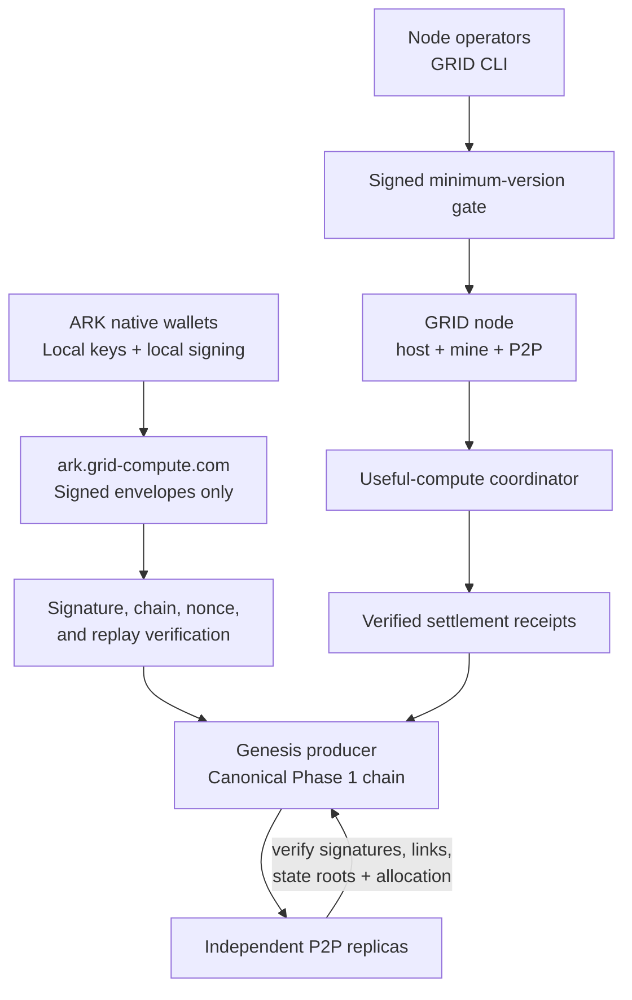

# GRID architecture

## Trust boundaries

- Wallet secrets remain on the device. Network services receive signed
  transaction envelopes, never private keys.
- Genesis signs the current minimum supported CLI version. `grid host`,
  `grid mine`, and `grid node` verify that signed policy before starting.
- The coordinator independently rejects claims from missing or outdated CLI
  versions, so older clients cannot bypass the local startup check.
- Genesis currently produces canonical Phase 1 blocks. Peers replicate and
  verify them; permissionless multi-validator finality remains a mainnet gate.

The live, visual contributor overview is maintained at
<https://docs.grid-compute.com/network#overview>.
